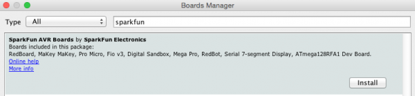

.. _promicroenv:

Installing Arduino IDE
""""""""""""""""""""""""

Go to `Arduino Download Site <https://www.arduino.cc/download_handler.php?f=/arduino-1.6.13-linux64.tar.xz>`_, choose `Just Download (unless you want to donate)`.

Next install arduino IDE:

.. code-block:: bash
    
    # considering you'd saved your .tar on Downloads:
    ~$ cd Downloads/
    ~/Downloads$ tar -xvJf arduino-1.6.13-linux64.tar.xz 
    ~/Downloads$ cd arduino-1.6.13
    ~/Downloads/arduino-1.6.13$ ./install.sh
    ~/Downloads/arduino-1.6.13$ export LD_LIBRARY_PATH=$LD_LIBRARY_PATH:/usr/lib/jni
    ~/Downloads/arduino-1.6.13$ sudo usermod -a -G tty $(whoami)
    ~/Downloads/arduino-1.6.13$ sudo usermod -a -G dialout $(whoami)

Once Ubuntu's ``modemmanager`` uses same port that Arduino Pro Micro, it's necessary to remove it from system:

.. code-block:: bash

	~$ sudo apt purge modemmanager

Log off and log on again for the changes to take effect!

Now you have Arduino IDE on your pc, it can be accesed from unity menu by justing searching for `Arduino`.

Let's install pro micro board on our arduino IDE

Firts you’ll need to point the Arduino IDE board manager to a custom URL. Open up Arduino, then go to the Preferences (File > Preferences). Then, towards the bottom of the window, paste this URL into the “Additional Board Manager URLs” text box:

.. code-block:: bash

    https://raw.githubusercontent.com/sparkfun/Arduino_Boards/master/IDE_Board_Manager/package_sparkfun_index.json

.. image:: images/arduino_sett.png

Click OK. Then open the Board Manager by clicking Tools, then hovering over the Board selection tab and clicking Board Manager.

.. image:: images/boardManager.png

Search for ‘sparkfun’ in the Board Manager. You should see the SparkFun AVR Boards package appear. Click install, wait a few moments, and all the .brd files you’ll need should be installed, indicated by the blue ‘Installed’ that is printed next to the package.

You should now be able to upload code to a number of SparkFun Arduino-compatible products, including the Fio and the Pro Micro.

.. image:: images/SFEBoards.png
